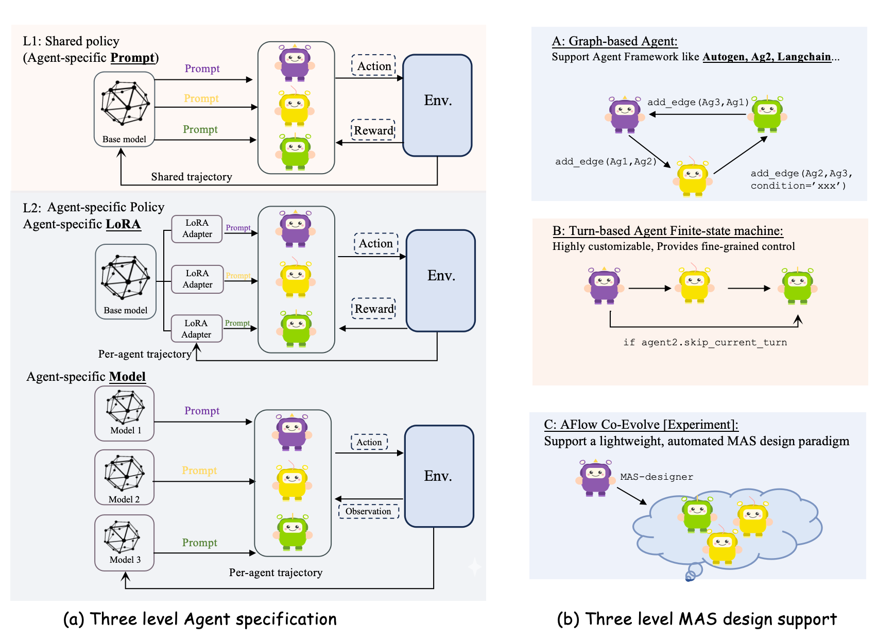

<div align="center">
  
  <h1>PETTINGLLMS</h1>
  <p>🚀 RL framework for training collaborative and self-organizing LLM agents.</p>
  <p>
    <a href="https://pettingllms-ai.github.io/">🌐 Website</a> •
    <a href="https://www.youtube.com/watch?v=8WM-gVTrSBc">🎮 Demo</a> •
    <a href="https://pettingllms-docs.readthedocs.io/en/latest/">📖 Documentation</a> •
    <a href="https://pettingllms-docs.readthedocs.io/en/latest/About_us/">👥 About Us</a> •
    <a href="figs/wechat.jpg"> PettingLLMs</a>
  </p>
</div>

PettingLLMs is an open-source framework for on-policy reinforcement learning with multi-agent large language models. It currently powers two lines of work:

- **🆕 Metaagent-X — *Breaking the Ceiling of Automatic Multi-Agent Systems via End-to-End Reinforcement Learning.* &nbsp;[📄 arXiv:2511.00000](https://arxiv.org/abs/2511.00000) (preprint link coming soon)** — an end-to-end framework that trains agentic models which can both **self-design** and **self-execute** their own MAS, jointly optimizing the meta-designer and the executor.
- **Stronger-MAS — *On-Policy Reinforcement Learning for Collaborative LLMs.* &nbsp;[📄 arXiv:2510.11062](https://arxiv.org/pdf/2510.11062)** — Agent- and Turn-wise Group Relative Policy Optimization (AT-GRPO) for training collaborative LLM agents in a *fixed* multi-agent system (MAS), with fine-grained per-agent / per-turn credit assignment and role-specialized policies.

---

# 1. 🆕 Metaagent-X — End-to-End Trainable Automatic MAS

[📄 Paper (arXiv:2511.00000)](https://arxiv.org/abs/2511.00000) *(temporary placeholder link — preprint coming soon)*

[🪄 Model](https://huggingface.co/Mercury7353/MetaAgent-X)

[🏆Project Page](https://mercury7353.github.io/MetaAgent-X-Page/)
<div align="center">
  
  <p><em>A. Comparison of three automatic MAS paradigms. &nbsp; B. Overview of the Metaagent-X training framework.</em></p>
</div>

Multi-agent systems have shown clear advantages over single-agent approaches across medical decision-making, scientific discovery, financial trading, software engineering, and hardware design. Recent work increasingly turns to **meta-agents** that automatically design and instantiate the MAS flow best suited to each task; in parallel, agentic RL and self-evolving paradigms are turning LLMs into interactive, continuously improving decision-makers. Yet existing automatic MAS remain only *partially adaptive* — they either search over MAS structures at test time, or optimize only the designer while **freezing** the downstream executor. **Metaagent-X** is our latest framework that closes this gap: it trains agentic models which can *self-design* **and** *self-execute* their MAS end-to-end. Task-conditioned auto-MAS designs are instantiated, executed, grouped, and collected for **role-aware policy updates** of both the designer and the executor — so the executor is no longer a hard ceiling on the meta-designer, and the designer can induce specialized execution behaviors from its counterpart.

This addresses two fundamental limitations of prior automatic MAS:

1. **Parameter-level disjunction.** Designer and executor are coupled only through prompt-level interactions at inference time, with no optimization signal that updates the underlying policy from downstream execution outcomes.
2. **Vague co-evolution dynamics.** How designer and executor co-evolve under joint training — and where each role's improvement comes from — remains unclear in practice.


## Results
Across **six math and code benchmarks** and **two base models**, Metaagent-X outperforms single-agent and automatic-MAS baselines by up to **21.7%**. Ablations show that (1) both the designer and the executor keep improving throughout training across tasks and domains, and (2) effective co-evolution follows a stagewise process in which the two components benefit from decoupled optimization.

## Quick Start (Metaagent-X)

```bash
# Interactive browser demo.
# This serves Mercury7353/MetaAgent-X with vLLM, opens a web UI, and lets users
# enter math/code queries while inspecting MAS design and execution traces.
bash scripts/evaluate/autoevol/serve_ui.sh

# If the model is already served on this machine or another host, only start the UI:
START_VLLM=false HOST=127.0.0.1 PORT=8300 bash scripts/evaluate/autoevol/serve_ui.sh

# One-shot CLI demo that writes an HTML report instead of serving a UI:
QUESTION="Find the value of x if 2x + 3 = 17. Answer with a single number." \
bash scripts/evaluate/autoevol/serve_demo.sh

# Eval-first benchmark run on the released model
bash scripts/evaluate/autoevol/eval_first_open_model.sh

# Training example: shared-policy co-training with hierarchical M*N rollouts
# and stage-wise alternate learning rates.
bash scripts/train/autoeval/example_cotrain_autoeval.sh
```

The interactive UI is served at `http://127.0.0.1:8899` by default. Each run
stores its artifacts under `outputs/autoeval_interactive/`, including
`mas_design.py`, executable `mas.py`, `execution.log`, `index.html`, retry
attempts, and the workflow visualization. The UI shows math/code examples, the
model's MAS design, execution pipeline, AgentNode traces, full logs, and final
result.
The auto-MAS environment, designer/executor agents, and reward functions live under
`pettingllms/multi_agent_env/autoevol/`, with configs in `pettingllms/config/autoevol/`.

---

# 2. Stronger-MAS / AT-GRPO

[📄 Paper (arXiv:2510.11062)](https://arxiv.org/pdf/2510.11062)

AT-GRPO (Agent- and Turn-wise Group Relative Policy Optimization) trains collaborative LLM agents across diverse tasks within a fixed MAS topology.

## Highlights
- AT-GRPO algorithm for fine-grained agent and turn-wise credit assignment.
- Agent-specific policies via LoRA or fully independent models.
- Multi-level rewards: process, agent, and global/team signals.
- Multimodal examples (e.g., Qwen2.5VL) for vision + language tasks.
- Seamless switch between single-agent and multi-agent training flows.

## Feature Snapshot

| Capability | PettingLLMs | AgentLightning / VERL (typical) |
| --- | ---: | ---: |
| Agent-specific LoRA & models (per-agent adapters or different base models) | ✅ | ❌ (one shared model) |
| Multi-level rewards (process + agent + global/team) | ✅ | ❌ (mostly global only) |
| Fine-grained grouping (turn/phase/role/tool-call) | ✅ | ❌ (often one-task = one-group) |
| Multimodal (see Qwen2.5VL examples) | ✅ | ❌ |

<div align="center">
  
</div>

**Supported modes**
- ✅ Single-agent RL training
- ✅ Multi-agent RL training (one role-sharing policy)
- ✅ Multi-agent RL training (role-specialized policies using different LoRA adapters or different LLMs)

## Agent Specification Levels

| Level | Specification Type | Architecture Components | Trajectory Flow | Description |
| :--- | :--- | :--- | :--- | :--- |
| **L1** | Shared Policy (agent-specific prompt) | 1 base model + distinct prompts | Shared trajectory | All agents share the same base model; roles are defined via different system prompts. |
| **L2** | Agent-specific Policy (agent-specific LoRA) | 1 base model + LoRA adapters | Per-agent trajectory | Agents share a base model but use lightweight, role-specific LoRA adapters for specialization. |
| **L3** | Agent-specific Model (full weights) | Independent models (Model 1, Model 2, Model 3...) | Per-agent trajectory | Each agent runs a separate model instance for maximal specialization. |

## MAS Design Options

| Category | Design Paradigm | Key Features & Support | Best For |
| :--- | :--- | :--- | :--- |
| **A** | Graph-based agent | Flexible topology; integrates with frameworks like AutoGen, Ag2, LangChain. | Complex, non-linear workflows needing external agent ecosystems. |
| **B** | Turn-based agent (finite-state machine) | Fine-grained control; customizable sequential execution. | Scenarios requiring precise operation order and state transitions. |
| **C** | AFlow Co-Evolve [experiment] | Automated design via a lightweight MAS-designer. | Experimental setups where the system self-optimizes agent structures. |

---

## 📰 News
- **[2026.04]** 🧠 **Metaagent-X** released — end-to-end RL for self-designing and self-executing automatic MAS; +21.7% over baselines across six math/code benchmarks.
- **[2025.12]** ✅ Roadmap milestone delivered: more environments (Verilog design, web search, robotics, database query, scientific discovery), multimodal support, and agentic framework integrations (AutoGen, LangGraph, LlamaIndex).
- **[2025.10]** 🚀 GitHub repository open-sourced and publicly available.
- **[2025.10]** 🎉 AT-GRPO (Stronger-MAS) paper released! Check out our [arXiv preprint](https://arxiv.org/pdf/2510.11062).
- **[2025.10]** 🔥 Support for different LoRA adapters per agent role—efficient role-specialized training.
- **[2025.09]** 🌍 Multi-environment support added: Game (Sudoku, Sokoban), Code (APPS, CodeContests), Math (AIME, OlympiadBench).
- **[2025.08]** 🤖 Multi-agent framework implementation: supports both shared single model and role-specific models.

## 📦 Installation

```bash
git clone https://github.com/pettingllms-ai/PettingLLMs.git
cd PettingLLMs
bash setup.bash
```

## 🎯 Quick Start

### 1) Dataset preparation

```bash
# Code tasks (APPS, CodeContests, LiveCodeBench)
python scripts/dataprocess/load_code.py

# Math tasks (AIME24/25, OlympiadBench)
python scripts/dataprocess/load_math.py

# Game/Planning tasks (Sokoban, Sudoku)
python scripts/dataprocess/load_sokoban.py
```

Datasets are saved to `datasets/code/`, `datasets/math/`, and `datasets/sudoku_environments/`.

### 2) Training

```bash
# Metaagent-X: shared-policy co-training with M*N hierarchical rollouts
bash scripts/train/autoeval/example_cotrain_autoeval.sh

# AT-GRPO: fixed multi-agent system on math tasks
bash scripts/train/math/math_L1_prompt.sh
```

Other AT-GRPO training scripts live in `scripts/train/`:
- `code_single_policy.sh`, `code_two_policy.sh` (code)
- `plan_path_single.sh`, `plan_path_two_policy.sh` (planning)
- `sokoban_two_policy.sh`, `sokodu_single.sh` (games)

### 3) Evaluation

Edit `scripts/evaluate/evaluate.sh` to set your model path and config:

```bash
MODEL_PATHS=("/path/to/your/model")
CONFIG_NAME="math_single_policy"
```

Then run:

```bash
bash scripts/evaluate/evaluate.sh
```

For MetaAgent-X, the eval-first entry point defaults to the released model:

```bash
bash scripts/evaluate/autoevol/eval_first_open_model.sh
```

## 📚 Citation

If you find PettingLLMs useful for your research or projects, please cite the relevant paper:

```bibtex
@article{metaagentx2026,
  title={Breaking the Ceiling of Automatic Multi-Agent Systems via End-to-End Reinforcement Learning},
  author={Yaolun, Zhang and others},
  journal={arXiv preprint arXiv:2511.00000},
  year={2026}
}

@article{zhao2025stronger,
  title={Stronger Together: On-Policy Reinforcement Learning for Collaborative LLMs},
  author={Zhao, Yujie and Hu, Lanxiang and Wang, Yang and Hou, Minmin and Zhang, Hao and Ding, Ke and Zhao, Jishen},
  journal={arXiv preprint arXiv:2510.11062},
  year={2025}
}
```

## 🔗 Acknowledgements

This work was primarily conducted by Yujie Zhao during her summer internship at **Intel Corporation**. We gratefully acknowledge Intel's support and resources.

- **VERL**: [VERL: Efficient RL Training for LLMs](https://github.com/volcengine/verl) — efficient distributed RL training infrastructure.
- **RLLM**: [RLLM: Reinforcement Learning with Language Models](https://github.com/rllm-org/rllm) — foundational RL algorithms for LLMs.

## 📌 License

Released under the MIT license. See `LICENSE` for details.
